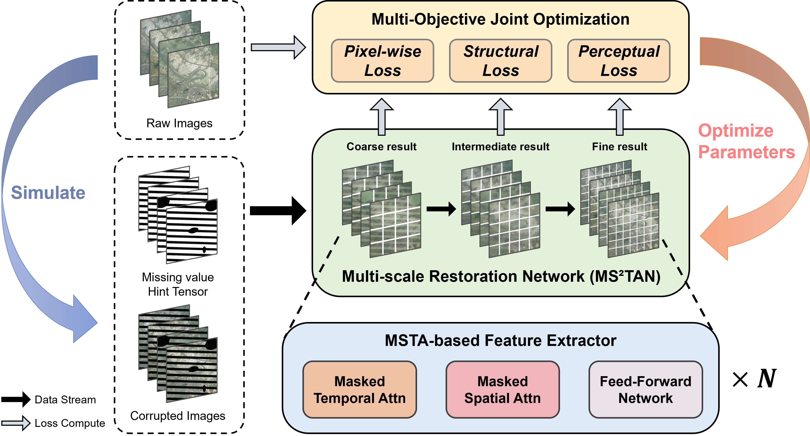
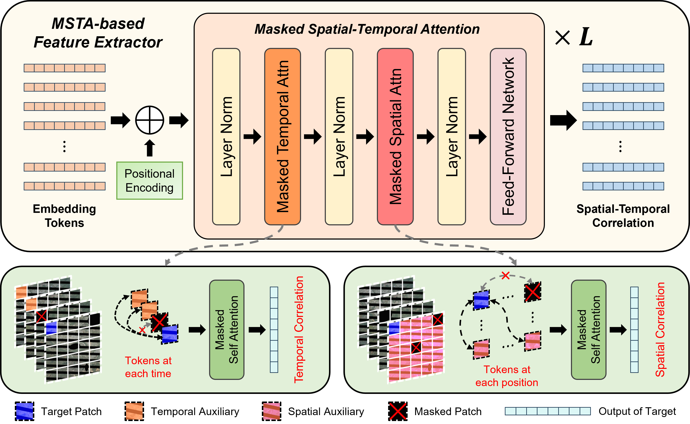
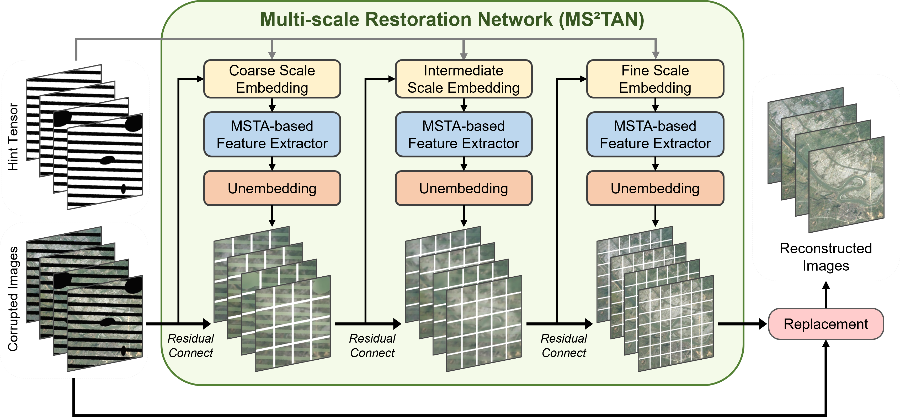

# MS$^2$TAN

The official PyTorch implementation of the paper "Multi-scale Restoration of Missing Data in Optical Time-series Images with Masked Spatial-Temporal Attention Network".

## Introduction of Proposed Method

The overall flowchart of the proposed method consists of two main components: a Multi-scale Restoration Network (named MS$^2$TAN) with MSTA-based Feature Extractors, and a ``Pixel-Structure-Perception'' Multi-Objective Joint Optimization method.

</img>


Illustration of the structure of the MSTA-based Feature Extractor (MFE). The input sequence is augmented with positional encoding to incorporate positional information. It then undergoes $L$ layers of Masked Spatial-Temporal Attention operations to obtain the output sequence, which combines temporal and spatial contextual features. The Masked Temporal/Spatial Attention, introduced below the image, respectively employ masked self-attention to capture the data distribution features in the Temporal/Spatial neighborhood.

</img>

The network structure diagram of proposed MS$^2$TAN (Multi-Scale Masked Spatial-Temporal Attention Network), which includes components such as Embedding, MFE, Unembedding, and Observed Value Replacement.

</img>


## Usage

```python
import torch
from models.network import *

device = "cuda"
num_frame = 10
num_channel = 6
img_size = 120

model = MS2TAN(
        dim_list=[384, 256, 192],
        num_frame=num_frame,
        image_size=img_size,
        patch_list=[12, 10, 8],
        in_chans=num_channel+1,
        out_chans=num_channel,
        depth_list=[4, 4, 4],
        heads_list=[8, 8, 8],
        dim_head_list=[48, 32, 24],
    ).to(device)
```
